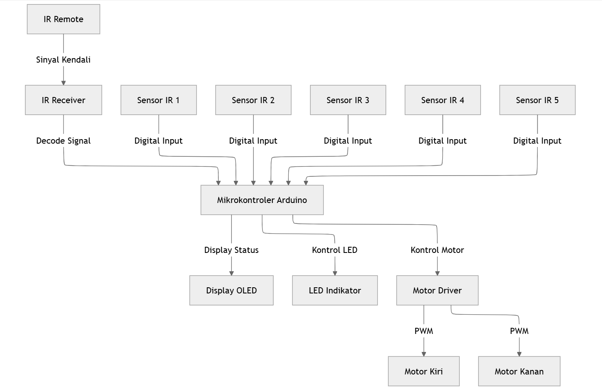
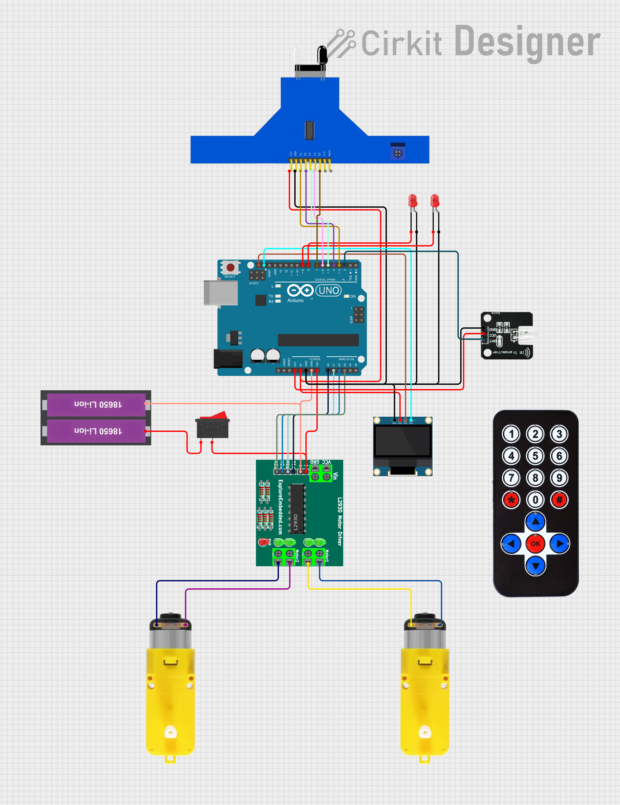
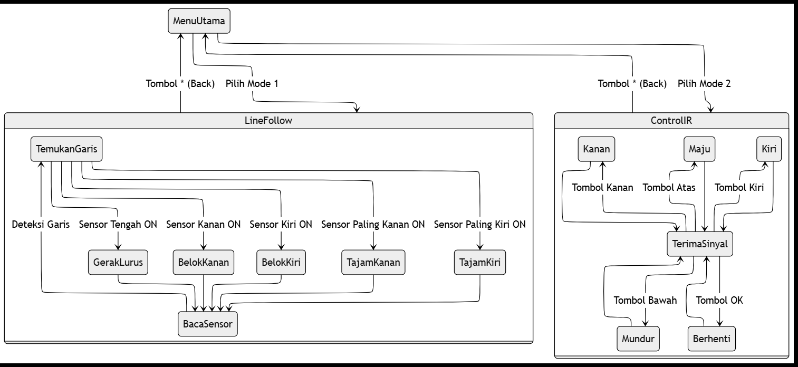
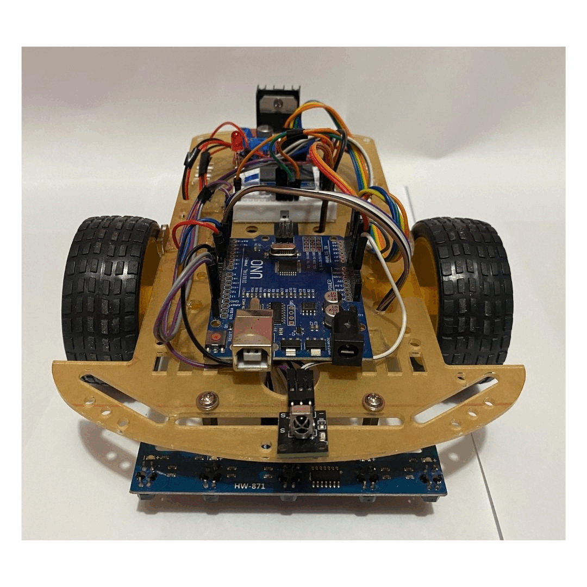

# 🤖 Arduino Line Follower Robot

This Arduino line follower robot uses a **5-channel line tracking sensor TRCT5000L** for precise path detection. The **OLED display (0.96 inch)** shows the robot's mode — either in manual mode via **IR remote control** or automatic line-following mode. The **L298N motor driver** controls the speed and direction of the DC motors, making the robot responsive and efficient.

## 🧩 Components Used
- Arduino Uno
- L298N Motor Driver
- 5-Channel Line Tracking Sensor (TRCT5000L)
- OLED Display (0.96 inch)
- IR Remote Control & Receiver
- DC Motors and Wheels
- Acrylic Chassis
- 18650 Battery
- Jumper Wires and Connectors

## ⚙️ Features
- Automatic line following with precise path detection.
- Manual control using an IR remote for flexible operation.
- OLED display for real-time mode feedback.

## 🏗️ Architecture

## 🔧 Schematic

## 🧠 Logic Flow

## 🚀 Getting Started
1. Assemble the components on the acrylic chassis.
2. Upload the Arduino code provided in this repository.
3. Power the system using the 18650 battery.
4. Use the IR remote to switch between manual and automatic modes.

## 📷 Project Preview

## 🤝 Contributing
Feel free to fork this repository, open issues, and submit pull requests to improve this project!

### Happy Building! 🛠️🤖 and Let's Get Rolling! 🚗💨
